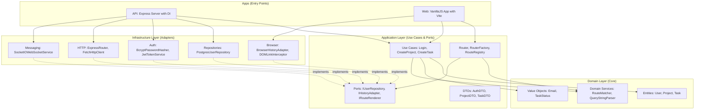

# Technical Design Document - Collaborateam

## Overview

Collaborateam is a real-time collaborative task management platform that demonstrates how a modern application can be built with pure VanillaJS without frontend frameworks, while providing a user experience comparable to Angular or Next.js.

### Main Objectives

- **Hexagonal Architecture**: Clear separation of Domain/Application/Infrastructure
- **Monorepo Architecture**: Modular structure with packages/{domain,application,infrastructure}, apps/{api,web}, tooling/
- **Pure VanillaJS**: No dependency on frontend frameworks (React, Vue, Angular)
- **Native CSS**: No CSS frameworks (TailwindCSS, Bootstrap)
- **Real-Time**: Synchronous collaboration via WebSockets
- **Performance**: Fast loading, smooth navigation, advanced optimizations
- **SOLID Principles**: Rigorous application of SOLID principles
- **Testability**: 100% testable via Dependency Injection

### Design Principles

1. **Hexagonal Architecture**: Independent Domain, Application with ports, Infrastructure with adapters
2. **SOLID Principles**:
   - Single Responsibility: Each class has only one reason to change
   - Open/Closed: Extensible via ports/adapters without modification
   - Liskov Substitution: Interchangeable adapters
   - Interface Segregation: Minimal and focused ports
   - Dependency Inversion: Dependencies toward abstractions
3. **Simplicity**: Readable and maintainable code without unnecessary abstractions
4. **Modularity**: Reusable components with separation of responsibilities
5. **Performance**: Native optimizations (event delegation, lazy loading, debouncing)
6. **Resilience**: Robust error handling and automatic reconnection
7. **Accessibility**: ARIA support and keyboard navigation

## Architecture

### Overview - Hexagonal Architecture



**Dependency Flow**:

```
apps/{api,web} → infrastructure → application → domain
```

**Golden Rule**: Dependencies **always point inward** (toward the domain)

### Monorepo Structure

```
collaborateam/
├── packages/              # Hexagonal layers
│   ├── domain/            # ❶ Pure business logic (entities, value objects, domain services)
│   │   ├── src/
│   │   │   ├── entities/      # User, Project, Task
│   │   │   ├── value-objects/ # Email, TaskStatus
│   │   │   └── services/      # RouteMatcher, QueryStringParser
│   │   └── package.json
│   │
│   ├── application/       # ❷ Use cases, ports (interfaces), DTOs
│   │   ├── src/
│   │   │   ├── use-cases/     # LoginUseCase, CreateProjectUseCase
│   │   │   ├── ports/         # IUserRepository, IHistoryAdapter
│   │   │   ├── router/        # Router, RouterFactory, RouteRegistry
│   │   │   └── dtos/          # AuthDTO, ProjectDTO
│   │   └── package.json
│   │
│   └── infrastructure/    # ❸ Adapters (concrete implementations)
│       ├── src/
│       │   ├── repositories/  # PostgresUserRepository
│       │   ├── auth/          # BcryptPasswordHasher, JwtTokenService
│       │   ├── browser/       # BrowserHistoryAdapter, DOMLinkInterceptor
│       │   ├── http/          # ExpressRouter, FetchHttpClient
│       │   └── messaging/     # SocketIOWebSocketService
│       └── package.json
│
├── apps/                  # Entry points
│   ├── api/               # Node.js/Express backend with DI
│   │   ├── src/
│   │   │   ├── index.js       # Entry point with DI container
│   │   │   └── config/        # Configuration
│   │   └── package.json
│   │
│   └── web/               # VanillaJS/Vite frontend
│       ├── src/
│       │   ├── main.js        # Entry point
│       │   ├── components/    # UI Components
│       │   └── styles/        # Native CSS
│       └── package.json
│
├── tooling/               # Shared configuration
│   ├── vitest-config/     # Vitest config
│   ├── prettier/          # Prettier config
│   ├── eslint-config/     # ESLint config
│   └── e2e-tests/         # Playwright E2E tests
│
├── pnpm-workspace.yaml
├── turbo.json
└── package.json
```

### Data Flow

**Hexagonal Architecture - Read Flow**:

1. UI Component (apps/web) calls a Use Case (application)
2. Use Case uses a Port (interface) - e.g., IUserRepository
3. Infrastructure provides the concrete Adapter - e.g., PostgresUserRepository
4. Adapter queries the database
5. Data mapped to Domain Entities
6. Entities go up via Use Case
7. DTOs returned to UI Component
8. Component updates itself

**Hexagonal Architecture - Write Flow**:

1. User action in UI Component (apps/web)
2. Component calls Use Case (application) - e.g., CreateTaskUseCase
3. Use Case validates with Domain Entities
4. Use Case uses Port ITaskRepository
5. Infrastructure Adapter (PostgresTaskRepository) persists
6. Backend Use Case uses Port IWebSocketService
7. Infrastructure Adapter (SocketIOWebSocketService) broadcasts
8. All clients receive via WebSocket
9. Frontend Use Case updates State Manager
10. Components re-render automatically

**Advantages of this Architecture**:

- ✅ **Testability**: Domain and Application testable without infrastructure
- ✅ **Flexibility**: Change DB/Framework without touching core
- ✅ **Maintainability**: Clear separation of responsibilities
- ✅ **Scalability**: New adapters without modifying core

## Components and Interfaces

### Architecture Layers

#### Domain Layer (packages/domain/)

**Responsibility**: Pure business logic, no external dependencies

**Content**:

- **Entities**: Objects with identity (User, Project, Task)
- **Value Objects**: Immutable objects without identity (Email, TaskStatus)
- **Domain Services**: Pure business logic (RouteMatcher, QueryStringParser)

**Example - Entity**:

```javascript
// packages/domain/src/entities/User.js
export class User {
  constructor(id, email, name, passwordHash) {
    this.id = id;
    this.email = email; // Email value object
    this.name = name;
    this.passwordHash = passwordHash;
  }

  static create({ email, name }) {
    return new User(generateId(), Email.create(email), name, null);
  }
}
```

**Example - Value Object**:

```javascript
// packages/domain/src/value-objects/Email.js
export class Email {
  constructor(value) {
    if (!this.isValid(value)) {
      throw new Error('Invalid email format');
    }
    this.value = value;
    Object.freeze(this); // Immutable
  }

  static create(value) {
    return new Email(value);
  }

  isValid(email) {
    return /^[^\s@]+@[^\s@]+\.[^\s@]+$/.test(email);
  }

  equals(other) {
    return this.value === other.value;
  }
}
```

**Example - Domain Service**:

```javascript
// packages/domain/src/services/RouteMatcher.js
export class RouteMatcher {
  pathToRegex(path) {
    const escaped = path.replace(/[.+?^${}()|[\]\\]/g, '\\$&');
    const pattern = escaped.replace(/:([^/]+)/g, '([^/]+)');
    return new RegExp(`^${pattern}$`);
  }

  extractParamNames(path) {
    const matches = path.match(/:([^/]+)/g);
    if (!matches) return [];
    return matches.map((match) => match.slice(1));
  }

  match(pathname, pattern, paramNames) {
    const match = pathname.match(pattern);
    if (!match) return null;

    const params = {};
    paramNames.forEach((name, index) => {
      params[name] = match[index + 1];
    });
    return { params };
  }
}
```

#### Application Layer (packages/application/)

**Responsibility**: Orchestration via use cases, port (interface) definitions

**Content**:

- **Use Cases**: Business scenarios (LoginUseCase, CreateProjectUseCase)
- **Ports**: Interfaces for infrastructure (IUserRepository, IHistoryAdapter)
- **Router**: Navigation orchestrator (Router, RouterFactory, RouteRegistry)
- **DTOs**: Data Transfer Objects

**Example - Use Case**:

```javascript
// packages/application/src/use-cases/auth/LoginUseCase.js
export class LoginUseCase {
  constructor({ userRepository, passwordHasher, tokenService }) {
    // Dependency Injection - depends on abstractions (ports)
    this.userRepository = userRepository;
    this.passwordHasher = passwordHasher;
    this.tokenService = tokenService;
  }

  async execute({ email, password }) {
    // Orchestration of business logic
    const user = await this.userRepository.findByEmail(email);
    if (!user) {
      throw new Error('User not found');
    }

    const isValid = await this.passwordHasher.compare(
      password,
      user.passwordHash,
    );
    if (!isValid) {
      throw new Error('Invalid credentials');
    }

    const token = this.tokenService.generate({ userId: user.id });

    return { token, user };
  }
}
```

**Example - Port (Interface)**:

```javascript
// packages/application/src/ports/repositories/IUserRepository.js
export class IUserRepository {
  async findByEmail(email) {
    throw new Error('Method not implemented');
  }

  async findById(id) {
    throw new Error('Method not implemented');
  }

  async save(user) {
    throw new Error('Method not implemented');
  }
}
```

**Example - Router (Application Service)**:

```javascript
// packages/application/src/router/Router.js
export class Router {
  constructor({
    historyAdapter, // Port IHistoryAdapter
    linkInterceptor, // Port ILinkInterceptor
    renderer, // Port IRouteRenderer
    routeRegistry,
    queryParser,
    guardExecutor,
  }) {
    // Dependency Injection - all are abstractions
    this.historyAdapter = historyAdapter;
    this.linkInterceptor = linkInterceptor;
    this.renderer = renderer;
    this.routeRegistry = routeRegistry;
    this.queryParser = queryParser;
    this.guardExecutor = guardExecutor;
  }

  navigate(path, state = {}) {
    this.historyAdapter.pushState(state, '', path);
    this.handleRoute(path, state);
  }

  async handleRoute(path, state = {}) {
    const { pathname, queryString } = this.queryParser.parsePath(path);
    const queryParams = this.queryParser.parse(queryString);
    const match = this.routeRegistry.findMatch(pathname);

    if (!match) {
      this.render404(pathname, queryParams, state);
      return;
    }

    const context = {
      path: pathname,
      params: match.params,
      query: queryParams,
      state,
      route: match.route,
    };

    const canActivate = await this.guardExecutor.execute(
      context,
      match.route.guards,
    );
    if (!canActivate) return;

    this.renderer.render(match.route.component, context);
  }
}
```

#### Infrastructure Layer (packages/infrastructure/)

**Responsibility**: Concrete port implementations (adapters)

**Content**:

- **Repositories**: Persistence (PostgresUserRepository, MongoTaskRepository)
- **Auth**: Authentication (BcryptPasswordHasher, JwtTokenService)
- **Browser**: Browser APIs (BrowserHistoryAdapter, DOMLinkInterceptor)
- **HTTP**: HTTP clients/servers (ExpressRouter, FetchHttpClient)
- **Messaging**: Real-time (SocketIOWebSocketService)

**Example - Repository Adapter**:

```javascript
// packages/infrastructure/src/repositories/UserRepository.js
import { IUserRepository } from '@workspace/application/ports/repositories/user';
import { User } from '@workspace/domain/entities/user';
import { Email } from '@workspace/domain/value-objects/email';

export class PostgresUserRepository extends IUserRepository {
  constructor(database) {
    super();
    this.db = database;
  }

  async findByEmail(email) {
    const row = await this.db.query('SELECT * FROM users WHERE email = $1', [
      email,
    ]);
    return row ? this.toDomain(row) : null;
  }

  async save(user) {
    await this.db.query(
      'INSERT INTO users (id, email, name, password_hash) VALUES ($1, $2, $3, $4)',
      [user.id, user.email.value, user.name, user.passwordHash],
    );
  }

  toDomain(row) {
    // Map DB row to Domain Entity
    return new User(
      row.id,
      Email.create(row.email),
      row.name,
      row.password_hash,
    );
  }
}
```

**Example - Browser Adapter**:

```javascript
// packages/infrastructure/src/browser/BrowserHistoryAdapter.js
import { IHistoryAdapter } from '@workspace/application/ports/browser/history-adapter';

export class BrowserHistoryAdapter extends IHistoryAdapter {
  constructor(window) {
    super();
    this.window = window;
  }

  pushState(state, title, url) {
    this.window.history.pushState(state, title, url);
  }

  back() {
    this.window.history.back();
  }

  forward() {
    this.window.history.forward();
  }

  getPathname() {
    return this.window.location.pathname;
  }

  getSearch() {
    return this.window.location.search;
  }

  onPopState(callback) {
    const handler = (event) => callback(event.state);
    this.window.addEventListener('popstate', handler);
    return () => this.window.removeEventListener('popstate', handler);
  }
}
```

### Frontend Core Components

#### 1. Router (Application Layer)

**Responsibility**: Client-side navigation orchestration via ports (abstractions).

**Architecture**:

- **Domain Services**: `RouteMatcher`, `QueryStringParser` (pure logic)
- **Application**: `Router`, `RouterFactory`, `RouteRegistry`, `GuardExecutor`
- **Ports**: `IHistoryAdapter`, `ILinkInterceptor`, `IRouteRenderer`
- **Infrastructure**: `BrowserHistoryAdapter`, `DOMLinkInterceptor`, `EventRouteRenderer`

**Interface**:

```javascript
// Application Layer
class Router {
  constructor({
    historyAdapter: IHistoryAdapter,
    linkInterceptor: ILinkInterceptor,
    renderer: IRouteRenderer,
    routeRegistry: RouteRegistry,
    queryParser: QueryStringParser,
    guardExecutor: GuardExecutor
  })

  // Navigation
  navigate(path: string, state?: object): void
  back(): void
  forward(): void

  // Route registration
  addRoute(route: Route): void
  addGuard(guard: RouteGuard): void

  // Lifecycle
  init(): void
  destroy(): void
}

interface Route {
  path: string              // "/projects/:id"
  component: Component      // View component
  guards?: RouteGuard[]     // Auth checks
}

interface RouteGuard {
  canActivate(context: RouteContext): boolean | Promise<boolean>
}
```

**Features**:

- Pattern matching for dynamic routes (`/projects/:id`) via `RouteMatcher` (domain)
- Query string parsing (`?status=done&assignee=user1`) via `QueryStringParser` (domain)
- History API (pushState/popState) via `IHistoryAdapter` (port)
- Route guards for authentication via `GuardExecutor` (application)
- 404 handling via `IRouteRenderer` (port)

**Applied SOLID Principles**:

- **Single Responsibility**: `RouteMatcher` only does matching, `QueryStringParser` only does parsing
- **Open/Closed**: Extensible via new adapters without modifying the Router
- **Liskov Substitution**: `BrowserHistoryAdapter` interchangeable with `MemoryHistoryAdapter` (tests)
- **Interface Segregation**: Minimal ports (`IHistoryAdapter`, `ILinkInterceptor`, `IRouteRenderer`)
- **Dependency Inversion**: Router depends on `IHistoryAdapter`, not `BrowserHistoryAdapter`

**Usage**:

```javascript
// Production (apps/web)
import { RouterFactory } from '@workspace/application/router/factory';

const router = RouterFactory.createBrowserRouter(routes);
router.init();

// Tests
import { Router } from '@workspace/application/router';

const router = new Router({
  historyAdapter: mockHistoryAdapter,
  linkInterceptor: mockLinkInterceptor,
  renderer: mockRenderer,
  routeRegistry: new RouteRegistry(new RouteMatcher()),
  queryParser: new QueryStringParser(),
  guardExecutor: new GuardExecutor(),
});
```

#### 2. State Manager

**Responsibility**: Centralized application state management with change notifications.

**Interface**:

```javascript
class StateManager {
  constructor(initialState: AppState)

  // State access
  getState(): AppState
  getSlice(path: string): any

  // State updates
  setState(updates: Partial<AppState>): void
  updateSlice(path: string, value: any): void

  // Subscriptions
  subscribe(listener: StateListener): Unsubscribe
  subscribeToSlice(path: string, listener: StateListener): Unsubscribe

  // Middleware
  use(middleware: Middleware): void
}

interface AppState {
  auth: AuthState
  projects: Project[]
  tasks: Task[]
  ui: UIState
  websocket: WebSocketState
}

type StateListener = (state: AppState, prevState: AppState) => void
type Middleware = (action: Action, next: () => void) => void
```

**Features**:

- Immutable updates (Object.freeze)
- Subscription system with path-based filtering
- Middleware support (logging, persistence)
- Performance: notification batching (< 10ms)

#### 3. WebSocket Manager

**Responsibility**: Real-time connection management with automatic reconnection.

**Interface**:

```javascript
class WebSocketManager {
  constructor(url: string, options: WSOptions)

  // Connection
  connect(): Promise<void>
  disconnect(): void
  isConnected(): boolean

  // Messaging
  send(event: string, data: object): void
  on(event: string, handler: MessageHandler): void
  off(event: string, handler: MessageHandler): void

  // Room management
  joinRoom(roomId: string): void
  leaveRoom(roomId: string): void
}

interface WSOptions {
  reconnect: boolean
  reconnectInterval: number
  maxReconnectAttempts: number
  heartbeatInterval: number
}

type MessageHandler = (data: any) => void
```

**Features**:

- Exponential backoff reconnection
- Heartbeat to detect dead connections
- Room-based messaging (project isolation)
- State synchronization after reconnection

#### 4. Component Base Class

**Responsibility**: Base class for all UI components with lifecycle.

**Interface**:

```javascript
class Component {
  constructor(props: ComponentProps)

  // Lifecycle
  mount(container: HTMLElement): void
  unmount(): void
  update(props: ComponentProps): void

  // Rendering
  render(): HTMLElement

  // State
  setState(updates: Partial<ComponentState>): void
  getState(): ComponentState

  // Events
  on(event: string, handler: EventHandler): void
  emit(event: string, data: any): void
}

interface ComponentProps {
  [key: string]: any
}

interface ComponentState {
  [key: string]: any
}
```

**Features**:

- Lightweight virtual DOM (minimal diff)
- Automatic event delegation
- Automatic cleanup (removeEventListener)
- Props validation

### Backend Services

#### 1. Authentication Service

**Responsibility**: Authentication and JWT token management.

**Interface**:

```javascript
class AuthService {
  async register(email: string, password: string): Promise<AuthResult>
  async login(email: string, password: string): Promise<AuthResult>
  async verifyToken(token: string): Promise<User>
  async refreshToken(refreshToken: string): Promise<AuthResult>
}

interface AuthResult {
  user: User
  accessToken: string
  refreshToken: string
}
```

**Security**:

- Bcrypt for password hashing (cost factor: 12)
- JWT with expiration (access: 15min, refresh: 7 days)
- HttpOnly cookies for tokens
- Rate limiting on login (5 attempts/15min)

#### 2. Project Service

**Responsibility**: CRUD operations for projects.

**Interface**:

```javascript
class ProjectService {
  async create(userId: string, data: CreateProjectDTO): Promise<Project>
  async findAll(userId: string): Promise<Project[]>
  async findById(projectId: string): Promise<Project>
  async update(projectId: string, data: UpdateProjectDTO): Promise<Project>
  async delete(projectId: string): Promise<void>
}
```

#### 3. Task Service

**Responsibility**: CRUD operations for tasks with real-time support.

**Interface**:

```javascript
class TaskService {
  async create(projectId: string, data: CreateTaskDTO): Promise<Task>
  async findByProject(projectId: string): Promise<Task[]>
  async update(taskId: string, data: UpdateTaskDTO): Promise<Task>
  async delete(taskId: string): Promise<void>
  async reorder(projectId: string, taskIds: string[]): Promise<void>
}
```

#### 4. WebSocket Service

**Responsibility**: Broadcasting real-time events.

**Interface**:

```javascript
class WebSocketService {
  broadcastToProject(projectId: string, event: string, data: any): void
  broadcastToUser(userId: string, event: string, data: any): void
  getConnectedUsers(projectId: string): User[]
}
```

## Data Models

### User Model

```javascript
interface User {
  id: string                // UUID
  email: string             // Unique, validated
  passwordHash: string      // Bcrypt hash
  name: string
  avatar?: string           // URL or base64
  createdAt: Date
  updatedAt: Date
}
```

**Validation**:

- Email: RFC 5322 format
- Password: min 8 chars, 1 uppercase, 1 lowercase, 1 number
- Name: 2-50 chars

### Project Model

```javascript
interface Project {
  id: string                // UUID
  name: string              // 1-100 chars
  description: string       // 0-500 chars
  ownerId: string           // User ID
  memberIds: string[]       // User IDs
  createdAt: Date
  updatedAt: Date
}
```

**Relations**:

- One-to-many: User → Projects (owner)
- Many-to-many: Users ↔ Projects (members)
- One-to-many: Project → Tasks

### Task Model

```javascript
interface Task {
  id: string                // UUID
  projectId: string         // Foreign key
  title: string             // 1-200 chars
  description: string       // 0-2000 chars
  status: TaskStatus        // Enum
  assigneeId?: string       // User ID (optional)
  order: number             // For drag-and-drop
  createdAt: Date
  updatedAt: Date
}

enum TaskStatus {
  TODO = 'todo',
  IN_PROGRESS = 'in-progress',
  DONE = 'done'
}
```

**Indexes**:

- `projectId` (for fast project queries)
- `assigneeId` (for user task lists)
- `(projectId, order)` (for ordered lists)

### WebSocket Message Format

```javascript
interface WSMessage {
  event: string             // "task:created", "task:updated", etc.
  projectId: string         // Room identifier
  data: any                 // Event payload
  timestamp: number         // Unix timestamp
  userId: string            // Sender ID
}
```

**Events**:

- `task:created` - New task
- `task:updated` - Modified task
- `task:deleted` - Deleted task
- `task:reordered` - Modified order
- `project:updated` - Modified project
- `user:joined` - User joined project
- `user:left` - User left project

### Parsers

#### Task Parser

```javascript
class TaskParser {
  static parse(json: string): Task
  static serialize(task: Task): string
  static validate(task: Task): ValidationResult
}
```

**Validation Rules**:

- `id`: UUID v4 format
- `title`: non-empty, max 200 chars
- `status`: valid TaskStatus enum value
- `order`: non-negative integer

#### Project Parser

```javascript
class ProjectParser {
  static parse(json: string): Project
  static serialize(project: Project): string
  static validate(project: Project): ValidationResult
}
```

**Validation Rules**:

- `id`: UUID v4 format
- `name`: non-empty, max 100 chars
- `memberIds`: array of valid UUIDs

## Correctness Properties

_A property is a characteristic or behavior that should hold true across all valid executions of a system—essentially, a formal statement about what the system should do. Properties serve as the bridge between human-readable specifications and machine-verifiable correctness guarantees._

### Property 1: Navigation Updates URL Without Reload

_For any_ navigation link in the application, clicking it should update the browser URL without triggering a full page reload.

**Validates: Requirements 2.2**

### Property 2: URL Changes Render Correct Component

_For any_ valid route in the router configuration, changing the URL to that route should render the corresponding view component.

**Validates: Requirements 2.3**

### Property 3: Dynamic Route Parameters Extraction

_For any_ route with dynamic parameters (e.g., `/projects/:id`), navigating to a matching URL should correctly extract and provide the parameter values to the component.

**Validates: Requirements 2.4**

### Property 4: Query String Parsing

_For any_ URL with query string parameters, the router should correctly parse and provide access to all query parameters.

**Validates: Requirements 2.5**

### Property 5: Route Guards Block Unauthorized Access

_For any_ protected route with authentication guards, attempting to access it without valid authentication should prevent navigation and redirect to the login page.

**Validates: Requirements 2.8, 3.5**

### Property 6: Invalid Routes Show 404

_For any_ URL that does not match any defined route, the router should display a 404 error page.

**Validates: Requirements 2.9**

### Property 7: Valid Credentials Return JWT Token

_For any_ valid user credentials (email and password), submitting them to the login endpoint should return a JWT token.

**Validates: Requirements 3.2**

### Property 8: Invalid Credentials Return Error

_For any_ invalid user credentials, submitting them to the login endpoint should return an error message within 500ms.

**Validates: Requirements 3.3**

### Property 9: JWT Token Storage After Login

_For any_ successful login, the frontend application should store the received JWT token in secure storage (httpOnly cookies or localStorage).

**Validates: Requirements 3.4**

### Property 10: Successful Registration Creates User and Returns Token

_For any_ valid registration data (email, password, name), submitting it should create a new user account and return a JWT token.

**Validates: Requirements 3.7**

### Property 11: Logout Clears Authentication Tokens

_For any_ authenticated session, calling the logout function should clear all authentication tokens from storage.

**Validates: Requirements 3.8**

### Property 12: Project List Matches User's Projects

_For any_ authenticated user, the displayed project list should contain exactly the projects owned by or shared with that user.

**Validates: Requirements 4.1**

### Property 13: Project Creation Persists and Returns Data

_For any_ valid project data (name and description), creating a project should persist it to the database and return the created project with a generated ID.

**Validates: Requirements 4.3**

### Property 14: Project Updates Persist

_For any_ valid project update data, updating a project should persist the changes to the database within 200ms.

**Validates: Requirements 4.5**

### Property 15: Project Deletion Cascades to Tasks

_For any_ project with associated tasks, deleting the project should remove both the project and all its tasks from the database.

**Validates: Requirements 4.7**

### Property 16: Project Serialization Round-Trip

_For any_ valid Project object, serializing it to JSON and then parsing it back should produce an equivalent Project object.

**Validates: Requirements 4.10**

### Property 17: Task List Matches Project's Tasks

_For any_ selected project, the displayed task list should contain exactly the tasks belonging to that project.

**Validates: Requirements 5.1**

### Property 18: Task Creation Persists and Returns Data

_For any_ valid task data (title, description, status, assignee), creating a task should persist it to the database and return the created task with a generated ID.

**Validates: Requirements 5.3**

### Property 19: Task Updates Persist

_For any_ valid task update data, updating a task should persist the changes to the database within 200ms.

**Validates: Requirements 5.5**

### Property 20: Task Deletion Removes from Database

_For any_ task, deleting it should remove it from the database and it should no longer appear in queries.

**Validates: Requirements 5.7**

### Property 21: Task Reordering Persists

_For any_ new task order within a project, reordering the tasks should persist the new order to the database.

**Validates: Requirements 5.9**

### Property 22: Task Serialization Round-Trip

_For any_ valid Task object, serializing it to JSON and then parsing it back should produce an equivalent Task object.

**Validates: Requirements 5.12**

### Property 23: Task Operations Broadcast to Project Clients

_For any_ task operation (create, update, delete) in a project, the backend should broadcast the change to all connected clients viewing that project within 100ms.

**Validates: Requirements 6.2, 6.3, 6.4**

### Property 24: WebSocket Reconnection on Connection Loss

_For any_ WebSocket connection that is lost, the WebSocket Manager should automatically attempt to reconnect using exponential backoff.

**Validates: Requirements 6.5**

### Property 25: State Synchronization After Reconnection

_For any_ WebSocket connection that is re-established after being lost, the frontend should synchronize its state with the server to ensure consistency.

**Validates: Requirements 6.6**

### Property 26: Connected Users Display Matches Actual

_For any_ project being viewed, the displayed list of connected users should match the actual users currently connected to that project via WebSocket.

**Validates: Requirements 6.7**

### Property 27: State Change Notifies Subscribers

_For any_ state change in the State Manager, all subscribed listeners should be notified of the change.

**Validates: Requirements 7.2**

### Property 28: Subscriber Notification Within 10ms

_For any_ state change, all subscribers should be notified within 10ms of the change occurring.

**Validates: Requirements 7.3**

### Property 29: State Updates Are Immutable

_For any_ state update operation, the previous state object should remain unchanged (immutability).

**Validates: Requirements 7.4**

### Property 30: Middleware Called on State Changes

_For any_ registered middleware in the State Manager, it should be called for every state change operation.

**Validates: Requirements 7.6**

### Property 31: WebSocket Messages Update State

_For any_ WebSocket message received, the State Manager should update the relevant state slice with the message data.

**Validates: Requirements 7.7**

### Property 32: Search Filters Tasks in Real-Time

_For any_ search query entered in the search field, the displayed tasks should be filtered in real-time to show only tasks whose title or description contains the query string.

**Validates: Requirements 8.2**

### Property 33: Status Filter Shows Matching Tasks

_For any_ task status filter selected (todo, in-progress, done), the displayed tasks should include only tasks with that status.

**Validates: Requirements 8.4**

### Property 34: Assignee Filter Shows Matching Tasks

_For any_ assignee filter selected, the displayed tasks should include only tasks assigned to that user.

**Validates: Requirements 8.6**

### Property 35: Combined Filters Apply Simultaneously

_For any_ combination of filters (search, status, assignee), the displayed tasks should match all active filters simultaneously.

**Validates: Requirements 8.7**

### Property 36: Route Navigation Completes Within 300ms

_For any_ route navigation, the new view should be loaded and rendered within 300ms.

**Validates: Requirements 10.3**

### Property 37: Search Input Is Debounced

_For any_ rapid sequence of search input changes, the filtering operation should be debounced to avoid excessive re-filtering (only the final input after a delay should trigger filtering).

**Validates: Requirements 10.4**

### Property 38: Cached Data Responds Within 50ms

_For any_ request for cached data, the backend server should respond within 50ms.

**Validates: Requirements 10.6, 10.7**

### Property 39: Network Failures Display Error Messages

_For any_ network request that fails, the frontend should display a user-friendly error message to the user.

**Validates: Requirements 11.1**

### Property 40: Server Errors Return Structured Response

_For any_ error encountered by the backend server, it should return a structured error response containing an error code and descriptive message.

**Validates: Requirements 11.2**

### Property 41: Invalid Form Data Shows Field-Specific Errors

_For any_ form submission with invalid data, the frontend should display field-specific validation error messages indicating which fields are invalid and why.

**Validates: Requirements 11.4**

### Property 42: Server Logs All Errors

_For any_ error encountered by the backend server, it should be logged with a timestamp and stack trace.

**Validates: Requirements 11.5**

### Property 43: Unhandled Exceptions Return 500

_For any_ unhandled exception in the backend server, it should return a 500 status code with a generic error message (without exposing internal details).

**Validates: Requirements 11.6**

### Property 44: Transactions Commit Before Response

_For any_ data creation or update operation, the backend should commit the database transaction before sending the response to the client.

**Validates: Requirements 12.2**

### Property 45: Failed Operations Rollback Transactions

_For any_ database operation that fails, the backend should rollback the transaction and return an error response.

**Validates: Requirements 12.3**

### Property 46: Invalid Data Rejected Before Persistence

_For any_ data that fails validation, the backend should reject it and return a validation error before attempting to persist it to the database.

**Validates: Requirements 12.5**

## Error Handling

### Frontend Error Handling Strategy

#### Network Errors

**Strategy**: Retry with exponential backoff + user feedback

```javascript
class APIClient {
  async request(url, options, retries = 3) {
    try {
      const response = await fetch(url, options);
      if (!response.ok) {
        throw new APIError(response.status, await response.json());
      }
      return response.json();
    } catch (error) {
      if (retries > 0 && this.isRetryable(error)) {
        await this.delay(Math.pow(2, 3 - retries) * 1000);
        return this.request(url, options, retries - 1);
      }
      this.showErrorToast(this.getUserFriendlyMessage(error));
      throw error;
    }
  }
}
```

**Error Types**:

- `NetworkError`: No internet connection
- `TimeoutError`: Request too long (> 30s)
- `ServerError`: 5xx status codes
- `ClientError`: 4xx status codes
- `ValidationError`: Invalid data

**User Feedback**:

- Toast notifications for temporary errors
- Modal for critical errors requiring action
- Inline errors for form validation
- Status indicator for WebSocket connection

#### WebSocket Error Handling

**Reconnection Strategy**:

```javascript
class WebSocketManager {
  reconnect() {
    if (this.reconnectAttempts >= this.maxReconnectAttempts) {
      this.showPermanentDisconnectError();
      return;
    }

    const delay = Math.min(
      1000 * Math.pow(2, this.reconnectAttempts),
      30000, // Max 30 seconds
    );

    setTimeout(() => {
      this.reconnectAttempts++;
      this.connect();
    }, delay);
  }
}
```

**Connection States**:

- `CONNECTING`: Connection attempt in progress
- `CONNECTED`: Connection established
- `DISCONNECTED`: Connection lost, attempting reconnection
- `FAILED`: Permanent failure after max attempts

#### Form Validation

**Client-Side Validation**:

- Real-time validation (onChange)
- Final validation before submission
- Field-specific error messages
- Submit button disabled if invalid

**Validation Rules**:

```javascript
const validationRules = {
  email: {
    required: true,
    pattern: /^[^\s@]+@[^\s@]+\.[^\s@]+$/,
    message: 'Invalid email',
  },
  password: {
    required: true,
    minLength: 8,
    pattern: /^(?=.*[a-z])(?=.*[A-Z])(?=.*\d)/,
    message:
      'Password must contain 8+ characters, 1 uppercase, 1 lowercase, 1 number',
  },
  projectName: {
    required: true,
    minLength: 1,
    maxLength: 100,
    message: 'Project name required (1-100 characters)',
  },
  taskTitle: {
    required: true,
    minLength: 1,
    maxLength: 200,
    message: 'Task title required (1-200 characters)',
  },
};
```

### Backend Error Handling Strategy

#### Error Response Format

**Standard Error Response**:

```javascript
{
  error: {
    code: 'VALIDATION_ERROR',
    message: 'Invalid input data',
    details: [
      {
        field: 'email',
        message: 'Email format is invalid'
      }
    ],
    timestamp: '2024-01-15T10:30:00Z',
    requestId: 'req_abc123'
  }
}
```

**Error Codes**:

- `VALIDATION_ERROR`: Invalid data (400)
- `AUTHENTICATION_ERROR`: Auth failed (401)
- `AUTHORIZATION_ERROR`: No permissions (403)
- `NOT_FOUND`: Resource not found (404)
- `CONFLICT`: Conflict (e.g., email already used) (409)
- `RATE_LIMIT_EXCEEDED`: Too many requests (429)
- `INTERNAL_ERROR`: Server error (500)
- `DATABASE_ERROR`: Database error (500)
- `WEBSOCKET_ERROR`: WebSocket error (500)

#### Global Error Handler

```javascript
app.use((error, req, res, next) => {
  // Log error with context
  logger.error({
    error: error.message,
    stack: error.stack,
    requestId: req.id,
    userId: req.user?.id,
    path: req.path,
    method: req.method,
    timestamp: new Date().toISOString(),
  });

  // Don't expose internal errors to client
  if (error.isOperational) {
    res.status(error.statusCode).json({
      error: {
        code: error.code,
        message: error.message,
        details: error.details,
        timestamp: new Date().toISOString(),
        requestId: req.id,
      },
    });
  } else {
    res.status(500).json({
      error: {
        code: 'INTERNAL_ERROR',
        message: 'An unexpected error occurred',
        timestamp: new Date().toISOString(),
        requestId: req.id,
      },
    });
  }
});
```

#### Database Error Handling

**Transaction Management**:

```javascript
async function createProjectWithTasks(userId, projectData, tasksData) {
  const transaction = await db.transaction();

  try {
    const project = await Project.create(projectData, { transaction });
    const tasks = await Task.bulkCreate(
      tasksData.map((t) => ({ ...t, projectId: project.id })),
      { transaction },
    );

    await transaction.commit();
    return { project, tasks };
  } catch (error) {
    await transaction.rollback();
    throw new DatabaseError('Failed to create project with tasks', error);
  }
}
```

**Connection Pool Error Handling**:

- Retry failed connections (max 3 attempts)
- Health checks every 30 seconds
- Graceful degradation if DB is unavailable
- Circuit breaker pattern to avoid cascade failures

#### Rate Limiting

```javascript
const rateLimit = require('express-rate-limit');

const loginLimiter = rateLimit({
  windowMs: 15 * 60 * 1000, // 15 minutes
  max: 5, // 5 attempts
  message: {
    error: {
      code: 'RATE_LIMIT_EXCEEDED',
      message: 'Too many login attempts, please try again later',
    },
  },
});

app.post('/api/auth/login', loginLimiter, authController.login);
```

### Error Monitoring

**Logging Strategy**:

- **Error logs**: All errors with stack traces
- **Warning logs**: Abnormal but handled situations
- **Info logs**: Important events (login, logout, etc.)
- **Debug logs**: Details for debugging (dev only)

**Log Aggregation**:

- Structured logging (JSON format)
- Correlation IDs to trace requests
- Log levels configurable by environment
- Log rotation (daily, max 30 days)

## Testing Strategy

### Overview

Collaborateam uses a dual testing approach combining **unit tests** for specific cases and **property-based tests** for universal validation. This strategy ensures complete coverage while avoiding redundancy.

### Testing Philosophy

**Unit Tests**:

- Specific cases and concrete examples
- Edge cases and boundary conditions
- Integration points between components
- Specific error behaviors

**Property-Based Tests**:

- Universal properties valid for all inputs
- Large-scale correctness validation
- Automatic test case generation
- Minimum 100 iterations per test

**Complementarity**: Unit tests capture concrete and specific bugs, while property tests verify general correctness. Together, they provide exhaustive coverage.

### Property-Based Testing Framework

**Chosen Framework**:

- **Frontend (JavaScript)**: `fast-check` - Property-based testing library for JavaScript
- **Backend (Node.js)**: `fast-check` - Same library for consistency

**Configuration**:

```javascript
import fc from 'fast-check';

// Global configuration
fc.configureGlobal({
  numRuns: 100, // Minimum 100 iterations
  verbose: true, // Show shrinking steps
  seed: Date.now(), // Reproducible with seed
  endOnFailure: false, // Continue after failure
});
```

**Tag Format**: Each property test must reference its property from the design document:

```javascript
describe('Feature: collaborateam, Property 16: Project Serialization Round-Trip', () => {
  it('should preserve project data through serialize-parse cycle', () => {
    fc.assert(
      fc.property(projectArbitrary, (project) => {
        const json = ProjectParser.serialize(project);
        const parsed = ProjectParser.parse(json);
        expect(parsed).toEqual(project);
      }),
    );
  });
});
```

### Test Organization

```
packages/
├── frontend/
│   ├── src/
│   │   └── __tests__/
│   │       ├── unit/           # Unit tests
│   │       │   ├── components/
│   │       │   ├── core/
│   │       │   └── services/
│   │       ├── property/       # Property-based tests
│   │       │   ├── router.property.test.js
│   │       │   ├── state.property.test.js
│   │       │   └── parsers.property.test.js
│   │       └── integration/    # Integration tests
│   │           └── e2e/
│   └── test/
│       └── arbitraries/        # Generators for property tests
│           ├── project.arbitrary.js
│           ├── task.arbitrary.js
│           └── user.arbitrary.js
│
└── backend/
    ├── src/
    │   └── __tests__/
    │       ├── unit/
    │       │   ├── services/
    │       │   ├── models/
    │       │   └── middleware/
    │       ├── property/
    │       │   ├── auth.property.test.js
    │       │   ├── projects.property.test.js
    │       │   └── tasks.property.test.js
    │       └── integration/
    │           ├── api/
    │           └── websocket/
    └── test/
        └── arbitraries/
            ├── project.arbitrary.js
            ├── task.arbitrary.js
            └── user.arbitrary.js
```

### Arbitraries (Generators)

**Project Arbitrary**:

```javascript
// test/arbitraries/project.arbitrary.js
import fc from 'fast-check';

export const projectArbitrary = fc.record({
  title: fc.string({ minLength: 1, maxLength: 200 }),
  description: fc.string({ maxLength: 2000 }),
  status: taskStatusArbitrary,
  assigneeId: fc.option(fc.uuid(), { nil: null }),
  order: fc.nat(),
  createdAt: fc.date(),
  updatedAt: fc.date(),
});
```

**User Arbitrary**:

```javascript
// test/arbitraries/user.arbitrary.js
import fc from 'fast-check';

export const emailArbitrary = fc.emailAddress();

export const userArbitrary = fc.record({
  id: fc.uuid(),
  email: emailArbitrary,
  name: fc.string({ minLength: 2, maxLength: 50 }),
  passwordHash: fc.string({ minLength: 60, maxLength: 60 }), // bcrypt hash length
  avatar: fc.option(fc.webUrl(), { nil: null }),
  createdAt: fc.date(),
  updatedAt: fc.date(),
});
```

### Property Test Examples

#### Property 16: Project Serialization Round-Trip

```javascript
describe('Feature: collaborateam, Property 16: Project Serialization Round-Trip', () => {
  it('should preserve project data through serialize-parse cycle', () => {
    fc.assert(
      fc.property(projectArbitrary, (project) => {
        const json = ProjectParser.serialize(project);
        const parsed = ProjectParser.parse(json);
        expect(parsed).toEqual(project);
      }),
      { numRuns: 100 }
    );
  });
});
```

#### Property 22: Task Serialization Round-Trip

```javascript
describe('Feature: collaborateam, Property 22: Task Serialization Round-Trip', () => {
  it('should preserve task data through serialize-parse cycle', () => {
    fc.assert(
      fc.property(taskArbitrary, (task) => {
        const json = TaskParser.serialize(task);
        const parsed = TaskParser.parse(json);

        expect(parsed).toEqual(task);
      }),
      { numRuns: 100 }
    );
  });
});
```

#### Property 23: Task Operations Broadcast to Project Clients

```javascript
describe('Feature: collaborateam, Property 23: Task Operations Broadcast to Project Clients', () => {
  it('should broadcast task creation to all project clients', async () => {
    await fc.assert(
      fc.asyncProperty(
        taskArbitrary,
        fc.array(fc.uuid(), { minLength: 2, maxLength: 5 }), // client IDs
        async (task, clientIds) => {
          const receivedMessages = [];

          // Setup mock clients
          const clients = clientIds.map((id) => ({
            id,
            onMessage: (msg) => receivedMessages.push({ clientId: id, msg }),
          }));

          // Connect clients to project
          clients.forEach((c) => wsService.connectToProject(task.projectId, c));

          // Create task
          await taskService.create(task.projectId, task);

          // Wait for broadcast
          await new Promise((resolve) => setTimeout(resolve, 150));

          // All clients should receive the message
          expect(receivedMessages.length).toBe(clientIds.length);
          receivedMessages.forEach(({ msg }) => {
            expect(msg.event).toBe('task:created');
            expect(msg.data.id).toBe(task.id);
          });
        },
      ),
      { numRuns: 100 },
    );
  });
});
```

#### Property 29: State Updates Are Immutable

```javascript
describe('Feature: collaborateam, Property 29: State Updates Are Immutable', () => {
  it('should not mutate previous state on updates', () => {
    fc.assert(
      fc.property(
        fc.record({
          projects: fc.array(projectArbitrary),
          tasks: fc.array(taskArbitrary),
        }),
        fc.record({
          projects: fc.array(projectArbitrary),
          tasks: fc.array(taskArbitrary),
        }),
        (initialState, updates) => {
          const stateManager = new StateManager(initialState);
          const previousState = stateManager.getState();
          const previousProjects = previousState.projects;

          stateManager.setState(updates);

          // Previous state should be unchanged
          expect(previousProjects).toEqual(initialState.projects);
          expect(previousState.projects).not.toBe(
            stateManager.getState().projects,
          );
        },
      ),
      { numRuns: 100 },
    );
  });
});
```

#### Property 35: Combined Filters Apply Simultaneously

```javascript
describe('Feature: collaborateam, Property 35: Combined Filters Apply Simultaneously', () => {
  it('should apply all filters simultaneously', () => {
    fc.assert(
      fc.property(
        fc.array(taskArbitrary, { minLength: 10, maxLength: 50 }),
        fc.string({ maxLength: 20 }), // search query
        taskStatusArbitrary, // status filter
        fc.uuid(), // assignee filter
        (tasks, searchQuery, statusFilter, assigneeFilter) => {
          const filtered = filterTasks(tasks, {
            search: searchQuery,
            status: statusFilter,
            assignee: assigneeFilter,
          });

          // All filtered tasks should match ALL criteria
          filtered.forEach((task) => {
            const matchesSearch =
              task.title.includes(searchQuery) ||
              task.description.includes(searchQuery);
            const matchesStatus = task.status === statusFilter;
            const matchesAssignee = task.assigneeId === assigneeFilter;

            expect(matchesSearch).toBe(true);
            expect(matchesStatus).toBe(true);
            expect(matchesAssignee).toBe(true);
          });
        },
      ),
      { numRuns: 100 },
    );
  });
});
```

### Unit Test Examples

#### Router Navigation

```javascript
describe('Router', () => {
  let router;

  beforeEach(() => {
    router = new Router([
      { path: '/', component: HomeComponent },
      { path: '/projects/:id', component: ProjectDetailComponent },
    ]);
    router.init();
  });

  afterEach(() => {
    router.destroy();
  });

  it('should navigate to home page', () => {
    router.navigate('/');
    expect(window.location.pathname).toBe('/');
  });

  it('should extract route parameters', () => {
    router.navigate('/projects/123');
    const params = router.getParams();
    expect(params.id).toBe('123');
  });

  it('should handle browser back button', () => {
    router.navigate('/projects/123');
    router.navigate('/');
    window.history.back();

    // Wait for popstate event
    setTimeout(() => {
      expect(window.location.pathname).toBe('/projects/123');
    }, 100);
  });
});
```

#### Authentication Service

```javascript
describe('AuthService', () => {
  let authService;

  beforeEach(() => {
    authService = new AuthService();
  });

  it('should return JWT token on valid login', async () => {
    const result = await authService.login('user@example.com', 'Password123');

    expect(result.accessToken).toBeDefined();
    expect(result.user.email).toBe('user@example.com');
  });

  it('should reject invalid credentials within 500ms', async () => {
    const startTime = Date.now();

    await expect(
      authService.login('user@example.com', 'wrongpassword'),
    ).rejects.toThrow('Invalid credentials');

    const duration = Date.now() - startTime;
    expect(duration).toBeLessThan(500);
  });

  it('should hash passwords with bcrypt', async () => {
    const password = 'Password123';
    const hash = await authService.hashPassword(password);

    expect(hash).not.toBe(password);
    expect(hash.length).toBe(60); // bcrypt hash length
    expect(await bcrypt.compare(password, hash)).toBe(true);
  });
});
```

#### WebSocket Manager

```javascript
describe('WebSocketManager', () => {
  let wsManager;

  beforeEach(() => {
    wsManager = new WebSocketManager('ws://localhost:3000', {
      reconnect: true,
      reconnectInterval: 1000,
      maxReconnectAttempts: 3,
    });
  });

  afterEach(() => {
    wsManager.disconnect();
  });

  it('should establish connection on connect', async () => {
    await wsManager.connect();
    expect(wsManager.isConnected()).toBe(true);
  });

  it('should attempt reconnection on connection loss', async () => {
    await wsManager.connect();

    // Simulate connection loss
    wsManager.ws.close();

    // Wait for reconnection attempt
    await new Promise((resolve) => setTimeout(resolve, 1500));

    expect(wsManager.reconnectAttempts).toBeGreaterThan(0);
  });

  it('should stop reconnecting after max attempts', async () => {
    wsManager.maxReconnectAttempts = 2;
    await wsManager.connect();

    // Simulate repeated connection failures
    for (let i = 0; i < 3; i++) {
      wsManager.ws.close();
      await new Promise((resolve) => setTimeout(resolve, 1500));
    }

    expect(wsManager.reconnectAttempts).toBe(2);
    expect(wsManager.isConnected()).toBe(false);
  });
});
```

### Integration Tests

#### API Integration

```javascript
describe('Projects API Integration', () => {
  let server;
  let authToken;

  beforeAll(async () => {
    server = await startTestServer();
    const response = await request(server)
      .post('/api/auth/login')
      .send({ email: 'test@example.com', password: 'Password123' });
    authToken = response.body.accessToken;
  });

  afterAll(async () => {
    await server.close();
  });

  it('should create, read, update, and delete project', async () => {
    // Create
    const createResponse = await request(server)
      .post('/api/projects')
      .set('Authorization', `Bearer ${authToken}`)
      .send({ name: 'Test Project', description: 'Test description' });

    expect(createResponse.status).toBe(201);
    const projectId = createResponse.body.id;

    // Read
    const readResponse = await request(server)
      .get(`/api/projects/${projectId}`)
      .set('Authorization', `Bearer ${authToken}`);

    expect(readResponse.status).toBe(200);
    expect(readResponse.body.name).toBe('Test Project');

    // Update
    const updateResponse = await request(server)
      .put(`/api/projects/${projectId}`)
      .set('Authorization', `Bearer ${authToken}`)
      .send({ name: 'Updated Project' });

    expect(updateResponse.status).toBe(200);
    expect(updateResponse.body.name).toBe('Updated Project');

    // Delete
    const deleteResponse = await request(server)
      .delete(`/api/projects/${projectId}`)
      .set('Authorization', `Bearer ${authToken}`);

    expect(deleteResponse.status).toBe(204);
  });
});
```

### Test Coverage Goals

**Target Coverage**:

- **Line Coverage**: 80%+
- **Branch Coverage**: 75%+
- **Function Coverage**: 85%+
- **Property Coverage**: 100% (all properties from design must have a test)

**Coverage Tools**:

- `nyc` (Istanbul) for JavaScript/Node.js
- Coverage reports in HTML and JSON
- CI/CD integration to block PRs below threshold

### Continuous Integration

**Test Pipeline**:

```yaml
# .github/workflows/test.yml
name: Test Suite

on: [push, pull_request]

jobs:
  test:
    runs-on: ubuntu-latest

    steps:
      - uses: actions/checkout@v2

      - name: Setup Node.js
        uses: actions/setup-node@v2
        with:
          node-version: '18'

      - name: Install dependencies
        run: pnpm install

      - name: Run unit tests
        run: pnpm test:unit

      - name: Run property tests
        run: pnpm test:property

      - name: Run integration tests
        run: pnpm test:integration

      - name: Generate coverage report
        run: pnpm test:coverage

      - name: Upload coverage to Codecov
        uses: codecov/codecov-action@v2
        with:
          files: ./coverage/coverage-final.json
```

**Test Scripts** (package.json):

```json
{
  "scripts": {
    "test": "pnpm test:unit && pnpm test:property && pnpm test:integration",
    "test:unit": "vitest run src/__tests__/unit",
    "test:property": "vitest run src/__tests__/property",
    "test:integration": "vitest run src/__tests__/integration",
    "test:coverage": "vitest run --coverage",
    "test:watch": "vitest watch"
  }
}
```

### Performance Testing

**Load Testing** (Backend):

```javascript
// Using k6 for load testing
import http from 'k6/http';
import { check, sleep } from 'k6';

export const options = {
  stages: [
    { duration: '30s', target: 20 }, // Ramp up to 20 users
    { duration: '1m', target: 20 }, // Stay at 20 users
    { duration: '30s', target: 0 }, // Ramp down to 0 users
  ],
  thresholds: {
    http_req_duration: ['p(95)<500'], // 95% of requests under 500ms
  },
};

export default function () {
  const response = http.get('http://localhost:3000/api/projects');
  check(response, {
    'status is 200': (r) => r.status === 200,
    'response time < 500ms': (r) => r.timings.duration < 500,
  });
  sleep(1);
}
```

**Frontend Performance**:

- Lighthouse CI to measure Core Web Vitals
- Bundle size monitoring (< 200KB initial)
- Time to Interactive (< 3s on 3G)
